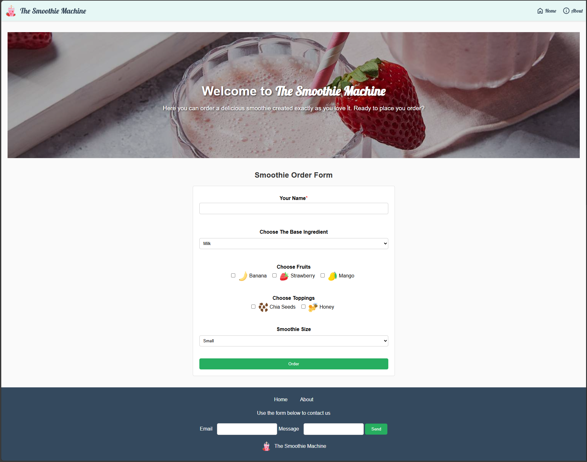
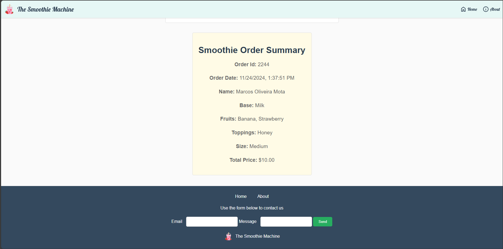
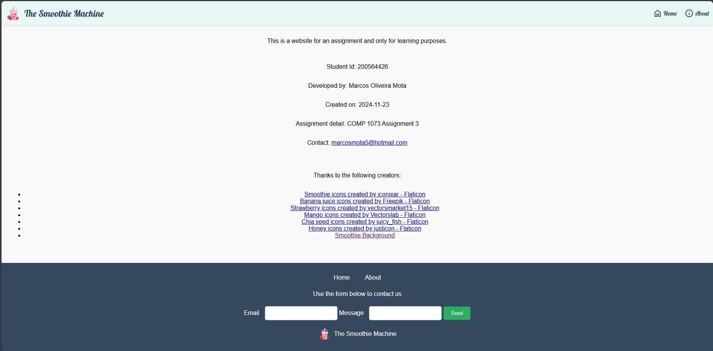

# COMP1073Assignment3

# The Smoothie Machine

This is a repository of a super simple webiste with a order for smoothies. This is for an assignment and for learning purposes.

**Assignment Detail:** COMP1073 Assignment 3
**Created on:** 2024-11-23

## Students Information

- <a href="https://github.com/marcosmota5" title="GitHub Profile">Marcos Oliveira Mota (200564426)</a>

## Screenshots

### Home  

### Order summary

### About

## Technologies Used

- **HTML**
- **CSS** 
- **JavaScript**

## Other

A big thanks to <a href="https://www.flaticon.com/" title="Flaticon">Flaticon</a> for providing for free so many amazing images. All icons in this project comes from Flaticon, so all rights are reserved to it.